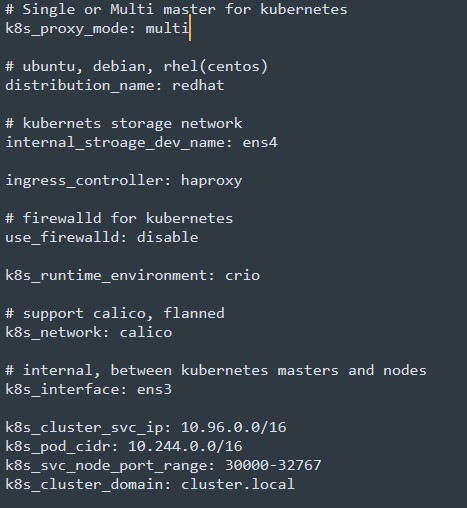
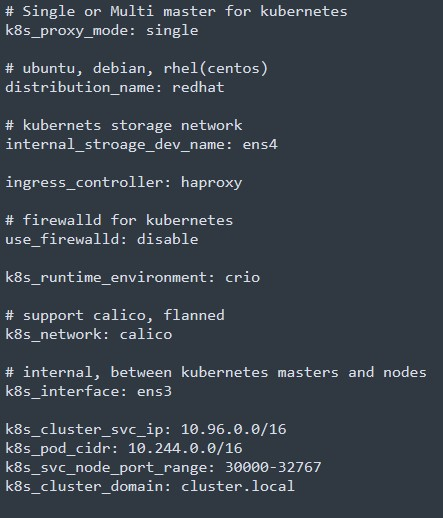

# 쿠버네티스 설치


## 프로젝트 설명

__이제는 싱글 노드 및 멀티노드 설치 둘 다 지원 합니다.__

앤서블 기반으로 쿠버네티스 설치를 도와주는 도구 입니다. 현재는 __CentOS/RHEL/Debian__ 만 지원하고 있습니다.
싱글노드 설치 부분에 대해서는 아래 설명을 참고 해주세요. 

사용 방법에 대해서 조만간 유튜브에 동영상 찍어서 올리도록 하겠습니다.

### 간단한 Q/A

자주 받은 메일 내용 정리해서 올려 드립니다.

__왜 파일에 코멘트가 없어요?__
-> 귀찮아서...그냥 안적고 있어요. v1.0릴리즈 하면 그때는 코멘트 꼬박꼬박 적겠습니다.

__더 이상 rebase는 없나요?__
-> 네, 단일/다중 마스터 노드를 하나의 플레이북으로 통합이 완료가 되었습니다. 더 이상은 없을 듯 합니다.

__유튜브 왜 자주 안올려주시나요?__
-> ㅈ...죄...죄송합니다..

### 설정 방법

설정은 플레이북 다운로드 하신 다음에 아래처럼 선택하시면 됩니다. 
멀티노드는 아래와 같이 설정 해주세요.



싱글모드는 다음과 같이 설정 해주세요.



## 알림사항

- CentOS 7/8/9 Stream버전에서 제일 안정적으로 설치가 지원 됩니다.
- 현재 Centos-9-Stream도 지원준비 하고 있습니다. 물론, Rocky Linux도 지원 합니다.
- ~~추가 기능은 **멀티 마스터 노드(multi-master)** 브렌치에서 다운로드 받으세요.~~
  
## 컴퓨터 사양

* **CPU:** Intel E5 or AMD Ryzen 5 5600X (Physically 4~6 cores)
* **Memory:** Minimun 8 GiB
* **Disk:** least 500GiB HDD or SSD 1TiB Recommend
* **NIC:** least 1GiB Bandwidth

리눅스 기반으로 구성하시는 경우, libvirt기반으로 가상머신 구성이 가능 합니다. 

## 가상머신에 설치하는 방법

### 가상머신 구성

#### 리눅스

가상머신을 생성하려면 다음과 같은 명령어로 실행 합니다.

```bash
# ansible-playbook playbooks/classroom.yaml
```

위의 명령어를 실행하면, 한대의 master와 3대의 node가 구성이 됩니다. 멀티 컨트롤노드가 필요한 경우에는 아래처럼 변경 합니다.

쿠버네티스 설치시 다음과 같은 명령어로 실행 합니다.

```bash
# ansible-playbook playbooks/k8s-install.yaml
```

#### 윈도우

VMware Workstation Player 혹은 VirtualBox, 권장은 VMware Workstation Player.

## 문의

다른 문의사항이 있으시면 아래로 연락 주세요! :)

**E-Mail:** <bluehelix@gmail.com>
**Name:** 최국현(Choi Gook Hyun)

## License

GNU 2라이센스